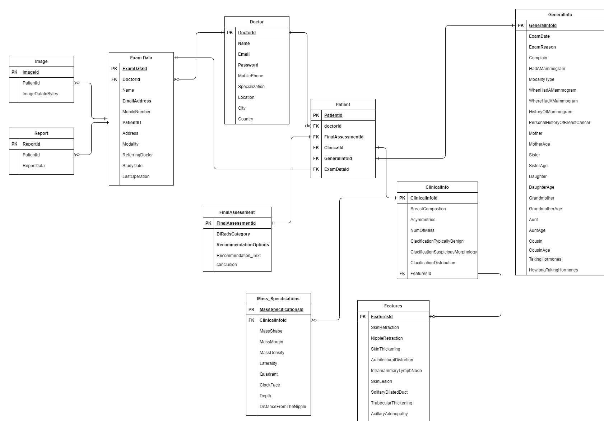

# Mammography Report Generation User Interface
User Interface that facilitates report generation to reduce the time needed to generate a structured report, help in early diagnosis, and improve healthcare quality.

It is built by using ASP.NET MVC for Backend, Entity Framework for database, and (Agulare + bootstrap) for Frontend.

our Entity Relation schema was

Demo for our website

<!--  -->

<figure class="video_container">
  <iframe src="https://www.youtube.com/embed/enMumwvLAug" frameborder="0" allowfullscreen="true"> </iframe>
</figure>

<figure class="video_container">
  <iframe src="https://drive.google.com/file/d/1gJlE3yskmN6LjUDZWJenRXtGzbzJRKBN/view" frameborder="0" allowfullscreen="true"> </iframe>
</figure>

we deploy our application to Microsoft Azure App Service and our database to Microsoft Azure SQL Database. Finally, This project was technically sponsored by DilenyTech LLC and funded by Academy of scientific Research & Technology (15,200 EGP) and ITIDA (10,000 EGP)
